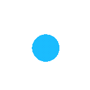

  

<h1 align="center">𝑬𝒙𝒑𝒆𝒓𝒕 𝑾𝒆𝒃 & 𝑴𝒐𝒃𝒊𝒍𝒆 𝑨𝒑𝒑 𝑫𝒆𝒗𝒆𝒍𝒐𝒑𝒆𝒓 | 𝑴𝒐𝒃𝒊𝒍𝒆 𝑨𝒓𝒄𝒉𝒊𝒕𝒆𝒄𝒕 | 𝑨𝑰 𝑰𝒏𝒕𝒆𝒈𝒓𝒂𝒕𝒊𝒐𝒏 | 𝑺𝑴𝑴</h1>

Greetings! I am a detail-oriented and passionate Full-Stack Developer with proficiency in a wide range of modern web and mobile technologies.

<h1>My Skills:</h1>

<h3>✨ Frontend:</h3>
• React.js (Hooks, Context API), Redux Saga/Thunk 
• Next.js (App Router, Server Action, Page Router, SSR, SSG) 
• Svelte/SvelteKit 
• Angular/AngularJS 
• Bootstrap, Tailwind CSS, MUI, Styled Components 
• HTML5, CSS3, SCSS, Sass 
• TanStack, D3.js 
...

<h3>⚙️ Backend:</h3>
• Node.js, Express.js, Nest.js 
• Rust, Ruby, Go 
• Headless CMS: Stripe 
• BaaS: Firebase, Supabase 
• MongoDB, MySQL, PostgreSQL, Mongoose, Sequelize, Prisma, TypeORM 
• Redis for Cache 
...

<h3>📱 Cross-platform Development:</h3>
• React Native: Expertise in delivering high-performance applications for both Android and iOS. 
• Flutter: Craft visually appealing and functionally rich apps with a single codebase. 
• Xamarin: Develop cross-platform applications that share code across platforms for greater efficiency. 
...

<h3>📲 Native Mobile Development:</h3>
• iOS: Proficient in Swift and Objective-C for top-tier iOS applications. 
• Android: Skilled in Java and Kotlin to create robust Android applications. 
• Windows Phone: Experience in building apps for Windows Mobile using .NET and C#. 
...

<h3>₿ Blockchain:</h3>
• Web3.js, Ethers.js 
• Truffle 
• Solidity 
...

<h3>➕ Additional Skills:</h3>

• Payment SDK: Stripe, PayPal 
• SMTP: SendGrid, PostMark 
• RESTful API, Apollo GraphQL, SocketIO, Websocket 
• Google Map Integration 
• Webpack, Babel, ESLint 
• Docker 
• Hosting: AWS, Vercel, Heroku, Plesk 
• Git, Jira, Trello 

𝐂𝐡𝐚𝐭𝐛𝐨𝐭 𝐃𝐞𝐯𝐞𝐥𝐨𝐩𝐦𝐞𝐧𝐭:

🌟ChatGPT, GPT-3,GPT-4, GPT-4 Turbo, OpenAI, HuggingFace, IBM Watson Assistant 
🌟Transformers, Botpress, Dialogflow, Langchain 
🌟Chatbot Integration, API Development, Prompt Engineering, Model Training and Fine-Tuning, Conversational Design, Sentiment Analysis, Named Entity Recognition, Text Classification, Language Generation, Speech-to-Text Integration, Intent Recognition

𝐈𝐦𝐚𝐠𝐞 𝐆𝐞𝐧𝐞𝐫𝐚𝐭𝐢𝐨𝐧:

🌟GANs, DeepDream, DALL-E, CLIP, Stable Diffusion 
🌟TensorFlow, PyTorch, Keras, OpenCV, Detectron, YOLO, Tesseract (OCR - Optical Character Recognition), Scikit-image, Caffe2, Hugging Face Transformers

𝐂𝐨𝐧𝐯𝐞𝐫𝐬𝐚𝐭𝐢𝐨𝐧𝐚𝐥 𝐀𝐈 / 𝐂𝐚𝐥𝐥𝐢𝐧𝐠 𝐀𝐠𝐞𝐧𝐭𝐬:

🌟DeepVoice, Google Duplex, Microsoft DeepSpeech, Mozilla DeepSpeech, Google Text-to-Speech API, Microsoft Azure Speech SDK 
🌟Microsoft Bot Framework, Rasa, Deepgram, Mozilla DeepSpeech, SpeechRecognition

Additional Libraries and Frameworks:

●Xamarin.Forms: Prism, MVVMCross, FreshMVVM  
●Flutter: Provider, Dio, Retrofit, MobX, GetIt, Firebase SDKs 
●Xamarin: Xamarin.Essentials, Newtonsoft.Json, SQLite.NET, Refit 
●Connection: Bluetooth, WiFi, NFC 
●Networking: Retrofit, Alamofire, Dio 
●Image Processing: Glide, Fresco, SDWebImage, ImagePicker 
●Data Visualization: Charts, MPAndroidChart, Flare 
●Location Services: Google Maps API, MapKit, Geolocator 
●Push Notifications: Firebase Cloud Messaging, OneSignal 
●Analytics: Google Analytics, Firebase Analytics, AppCenter Analytics 
●Payment Integration: Stripe, PayPal, Braintree 
●Social Media Integration: Facebook SDK, Twitter API, Google Sign-In 

❓ What You'll Get If You Hire Me:

• A dedicated and reliable partner who quickly grasps project requirements and communicates effectively throughout the development process.
• Exceptional results delivered on time, with clean, well-structured, and scalable code that adheres to industry best practices.

Please feel free to reach out to me for further discussion.

### Dev Quote

## 

### Languages & Tools

<table align="center">
  <tr>
      <td align="center" width="96">
           
       Swift
    </td>
    <td align="center" width="96">
         
       OBJ-C
    </td>
    <td align="center" width="96">
           
       Android
    </td>
    <td align="center" width="96">
           
       Kotlin
    </td>
    <td align="center"  width="96">
           
       Flutter
    </td>
    <td align="center" width="96">
          
       Dart
    </td>
        <td align="center" width="96">
           
       ReactNative
    </td>
    <td align="center" width="96">
           
       Ionic
    </td>
    <td align="center" width="96">
          
       Xamarin
    </td>
  </tr>
  <tr>
    <td align="center"  width="96">
        
       Solidity
    </td>
    <td align="center" width="96">
           
       C++
    </td>
    <td align="center" width="96">
           
       C
    </td>
    <td align="center" width="96">
           
       GraphQL
    </td>
    <td align="center" width="96">
        
       Sass
    </td>
    <td align="center" width="96">
        
       Less
    </td>
    <td align="center" width="96">
        
       Bootstrap
    </td>
    <td align="center" width="96">
        
       Tailwind
    </td>
    <td align="center" width="96">
        
       MUI
    </td>
  </tr>
  <tr>
    <td align="center" width="96">
        
       Svelte
    </td>
    <td align="center"  width="96">
        
       React
    </td>
    <td align="center" width="96">
        
       Next.js
    </td>
    <td align="center" width="96">
        
       Vue
    </td>
    <td align="center" width="96">
        
       Nuxt.js
    </td>
    <td align="center" width="96">
        
       Angular
    </td>
    <td align="center" width="96">
        
       Lit
    </td>
    <td align="center" width="96">
        
       Ember.js
    </td>
    <td align="center" width="96">
        
       SolidJS
    </td>
  </tr>
  <tr>
    <td align="center"  width="96">
        
       Node.js
    </td>
    <td align="center" width="96">
        
       Express.js
    </td>
    <td align="center" width="96">
        
       NestJS
    </td>
    <td align="center" width="96">
        
       FastAPI
    </td>
    <td align="center" width="96">
        
       Flask
    </td>
    <td align="center" width="96">
           
       Django
    </td>
    <td align="center" width="96">
        
       Python
    </td>
    <td align="center" width="96">
        
       Laravel
    </td>
    <td align="center" width="96">
        
       RoR
    </td>
  </tr>
  <tr>
    <td align="center"  width="96">
        
       MySQL
    </td>
    <td align="center" width="96">
        
       PostgreSQL
    </td>
    <td align="center" width="96">
        
       MongoDB
    </td>
    <td align="center" width="96">
        
       Redis
    </td>
    <td align="center" width="96">
        
       DynamoDB
    </td>
    <td align="center" width="96">
        
       Git
    </td>
    <td align="center" width="96">
        
       GitHub
    </td>
    <td align="center" width="96">
        
       GitLab
    </td>
    <td align="center" width="96">
        
       Bitbucket
    </td>
  </tr>
  <tr>
    <td align="center"  width="96">
           
       AWS
    </td>
    <td align="center" width="96">
        
       GCP
    </td>
    <td align="center" width="96">
        
       Azure
    </td>
    <td align="center" width="96">
        
       Heroku
    </td>
    <td align="center" width="96">
        
       Supabase
    </td>
    <td align="center" width="96">
           
       Docker
    </td>
    <td align="center" width="96">
        
       Jenkins
    </td>
    <td align="center" width="96">
        
       Kubernetes
    </td>
    <td align="center" width="96">
        
       Terraform
    </td>
  </tr>
  <tr>
    <td align="center" width="96">
        
       Webpack
    </td>
    <td align="center" width="96">
        
       Nginx
    </td>
    <td align="center" width="96">
        
       Vercel
    </td>
    <td align="center" width="96">
           
       Figma
    </td>
    <td align="center" width="96">
        
       Jest
    </td>
    <td align="center" width="96">
        
       Prisma
    </td>
    <td align="center" width="96">
        
       AI
    </td>
    <td align="center" width="96">
        
       Bash
    </td>
     <td align="center" width="96">
        
       Java
    </td>
  </tr>
</table>

### Github Stats

 

### GitHub Stats Degree

<table>
<tr>
<td><strong>S</strong></td>
<td>👑</td>
<td><em>Elite among the elite!</em></td>
<td><strong>Top 1%</strong></td>
</tr>
<tr>
<td><strong>A+</strong></td>
<td>🏆🏆🏆</td>
<td><em>Outstanding performance!</em></td>
<td><strong>Top 12.5%</strong></td>
</tr>
<tr>
<td><strong>A</strong></td>
<td>🏆🏆</td>
<td><em>Excellent skills!</em></td>
<td><strong>Top 25%</strong></td>
</tr>
<tr>
<td><strong>A-</strong></td>
<td>🏆</td>
<td><em>Great job!</em></td>
<td><strong>Top 47.5%</strong></td>
</tr>
<tr>
<td><strong>B+</strong></td>
<td>⭐⭐⭐⭐⭐</td>
<td><em>Solid contributions!</em></td>
<td><strong>Top 50%</strong></td>
</tr>
<tr>
<td><strong>B</strong></td>
<td>⭐⭐⭐⭐</td>
<td><em>Consistent efforts!</em></td>
<td><strong>Top 62.5%</strong></td>
</tr>
<tr>
<td><strong>B-</strong></td>
<td>⭐⭐⭐</td>
<td><em>Keep pushing forward!</em></td>
<td><strong>Top 75%</strong></td>
</tr>
<tr>
<td><strong>C+</strong></td>
<td>⭐⭐</td>
<td><em>Room for growth!</em></td>
<td><strong>Top 87.5%</strong></td>
</tr>
<tr>
<td><strong>C</strong></td>
<td>⭐</td>
<td><em>Welcome to the journey!</em></td>
<td><strong>Everyone</strong></td>
</tr>
</table>

  

